### Hi there 

I'm a Computer Science student at [University of Brasília](https://www.unb.br/), 
Working on projects related to Bioinformatics & Computational Biology.

---

### 💻 Tech

- ##### Programming Languages:

  
  
  
  
  
  
  
  
  <!--  -->

- ##### Tools:

  
  
  
  
  
  
  <!--  -->
  <!--  -->
  <!--  -->
  <!--  -->
  <!--  -->

- ##### Plan to Learn:
  
  
  <!--  -->
  <!--  -->
  <!--  -->
  <!--  -->
  <!--  -->

---

📊 Statistics

  
 

 

